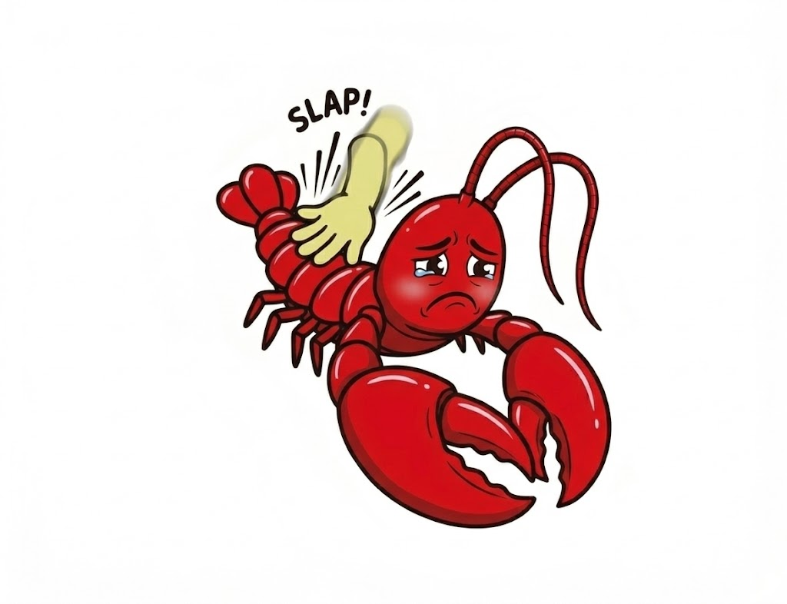

<p align="center">
  
</p>

# spank-claw

**Bad claw. Bad.**

Slap your MacBook lightly: nudge your claw to try again. Slap it hard: send it scurrying back to fix what it broke. Slap it repeatedly: well, things escalate.

Because sometimes `Ctrl+C` doesn't convey enough discipline.

Fork of [taigrr/spank](https://github.com/taigrr/spank).

## Install

```bash
go install github.com/janzheng/spank-claw@latest
sudo cp "$(go env GOPATH)/bin/spank-claw" /usr/local/bin/spank-claw
```

Or clone and build:

```bash
git clone https://github.com/janzheng/spank-claw.git
cd spank-claw
go build -o spank-claw .
sudo ./spank-claw --claude
```

**Requirements:** macOS on Apple Silicon (M2+, or M1 Pro), `sudo` for accelerometer access, Terminal needs Accessibility permissions (System Settings -> Privacy & Security -> Accessibility), Go 1.26+ if building from source.

## Usage

```bash
# Claude mode -- slap to send frustrated prompts
sudo spank-claw --claude

# Stack with any audio mode
sudo spank-claw --claude --sexy         # moans + angry prompts
sudo spank-claw --claude --halo         # Halo death sounds + angry prompts
sudo spank-claw --claude --custom ~/mp3 # your sounds + angry prompts

# Audio-only modes (original spank behavior)
sudo spank-claw                         # says "ow!" when slapped
sudo spank-claw --sexy                  # escalating moans
sudo spank-claw --halo                  # Halo death sounds
sudo spank-claw --lizard                # lizard mode
sudo spank-claw --custom /path/to/mp3s  # your own sounds

# Tuning
sudo spank-claw --min-amplitude 0.2     # more sensitive
sudo spank-claw --min-amplitude 0.5     # less sensitive (only real slaps)
sudo spank-claw --cooldown 5000         # 5s between triggers
sudo spank-claw --fast                  # faster polling, shorter cooldown
sudo spank-claw --speed 0.7             # slower and deeper audio
sudo spank-claw --volume-scaling        # harder slaps = louder audio
```

## The escalation curve

Intensity builds over a rolling 5-minute window with exponential decay. One slap is a gentle nudge. Sustained slapping is a code review.

```
gentle:     "hmm, that's not quite what I meant"
annoyed:    "wrong direction -- re-read TASKS.md"
frustrated: "STOP. Read the spec. THEN code."
furious:    "STOP. BREATHE. READ THE TASK. DO ONLY THE TASK."
            (prompt injection caps here for safety)
rage:       audio only (some things should only be screamed, not typed)
despair:    audio only
acceptance: audio only
```

Each prompt includes metadata: `<!-- frustration: 0.47g level: 23/60 -->`

### Custom prompts

Edit `prompts.json` or pass your own with `--prompts`:

```bash
sudo spank-claw --claude --prompts my-prompts.json
```

```json
{
  "levels": {
    "gentle":     ["try again sweetie", "not quite"],
    "annoyed":    ["no, the OTHER file", "read the task"],
    "frustrated": ["UNDO THAT", "WHY"],
    "furious":    ["REVERT. EVERYTHING."],
    "rage":       ["..."],
    "despair":    ["I give up"],
    "acceptance": ["ok. let's start over."]
  },
  "max_typed_level": 35
}
```

The flat array format also works: `{"prompts": ["level 1", "level 2", ...]}`

## Calibration tips

Claude mode defaults to 0.35g amplitude threshold and 1.2s cooldown (higher than audio modes) because **your typing registers as 0.05g impacts** and you do NOT want prompts injected every time you hit Enter.

- Put your laptop on a hard, flat surface (soft surfaces dampen impacts)
- Normal typing is ~0.05-0.08g. Default threshold of 0.35g ignores this.
- A real palm-slap is ~0.3-0.6g. An angry fist is 0.7g+.
- Moving the laptop sideways also triggers it (accelerometer reads all axes)
- If prompts appear while you're just typing, raise `--min-amplitude`

## How it works

```
Accelerometer (IOKit HID, Bosch BMI286 IMU)
    |
    v
Impact detection (STA/LTA, CUSUM, kurtosis -- seismology algorithms!)
    |
    v
Slap tracker (rolling 5-min window, 30s exponential decay half-life)
    |
    v
Score -> prompt level (1-exp(-x) curve, gentler for claude mode)
    |
    +---> Audio playback (embedded MP3, amplitude-scaled volume)
    |
    +---> osascript keystroke injection (macOS Accessibility API)
          |
          v
    Claude Code receives it as normal user input
    Claude has no idea it came from a slap
    Claude apologizes anyway
```

## The "frustration as metadata" hypothesis

There's an actually interesting idea buried in this joke: **physical frustration is a signal that text can't capture.** When you type "please try again," Claude doesn't know if you're mildly curious or silently fuming. But `<!-- frustration: 0.47g level: 23/60 -->` is unambiguous.

An agent that receives frustration metadata could:
- Be more conservative at high g-force (don't experiment, do exactly what was asked)
- Take more creative liberties at low g-force (user is calm, room to try things)
- Detect escalation patterns (3 slaps in 60 seconds = fundamentally wrong approach)

Is this a good idea? Absolutely not. Is it a better feedback mechanism than passive-aggressively rewriting your prompt for the fourth time? Maybe.

## Credits

- [taigrr/spank](https://github.com/taigrr/spank) -- the original. All the accelerometer magic, audio playback, and escalation tracking.
- [olvvier/apple-silicon-accelerometer](https://github.com/olvvier/apple-silicon-accelerometer) -- sensor reading and vibration detection.
- spank-claw adds `--claude` mode: 60 frustration-scaled prompts + macOS Accessibility keystroke injection.

## License

MIT
